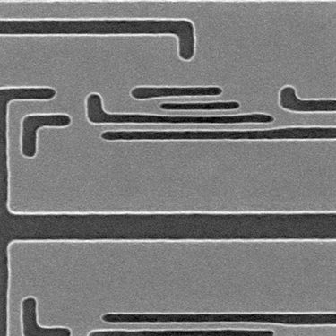
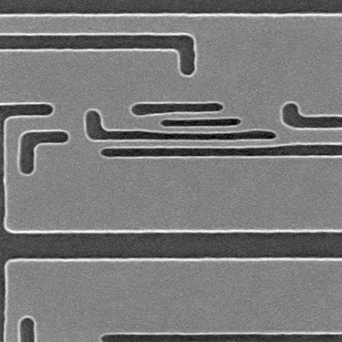
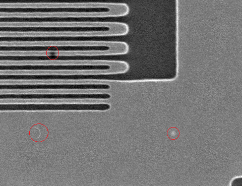
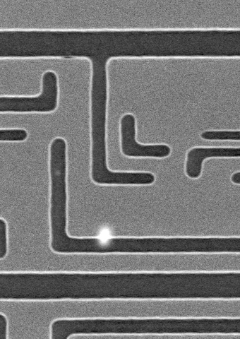
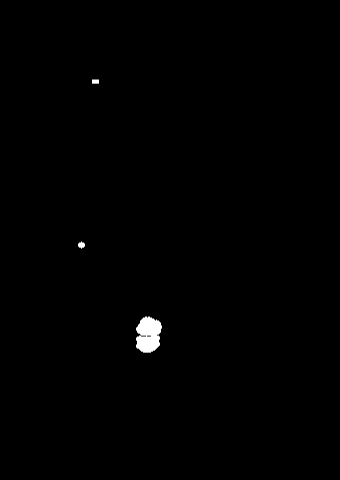
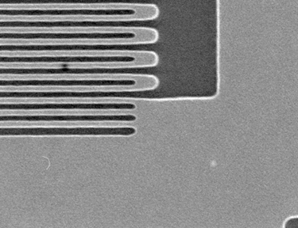
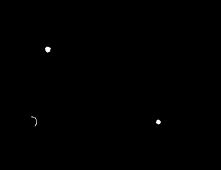
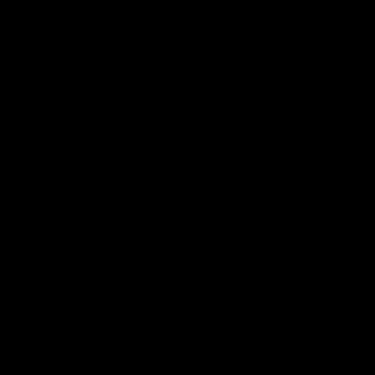

# Defects Detection in SEM Images
[](https://github.com/DAVFoundation/captain-n3m0/blob/master/LICENSE)

Given two SEM (Scanning Electron Microscope) images, a Query (“inspected”) image and a Train (“reference”) image, the goal is to detect defect patterns such as bridge, break and line collapses as well as blotches.

## Assumptions
### 1. Query and Train images are not aligned
In other words, there are areas of the query image that are not represented in the Train image. Therefore, any defect that may be present in these non-overlapping regions will not be detected using the information provided by the Train image. 

Example:

<div align=center>
  
  &nbsp;&nbsp;&nbsp;&nbsp;&nbsp;
   
</div>
<div align=center>
 An example of the query image 
 &nbsp;&nbsp;&nbsp;&nbsp;&nbsp;&nbsp;&nbsp;&nbsp;&nbsp;&nbsp;&nbsp;&nbsp;&nbsp;&nbsp;&nbsp; &nbsp;&nbsp;&nbsp;&nbsp;&nbsp;&nbsp;&nbsp;&nbsp;&nbsp;&nbsp;&nbsp;&nbsp;&nbsp;&nbsp;&nbsp;&nbsp;&nbsp;&nbsp;&nbsp;&nbsp;&nbsp;&nbsp;&nbsp;
 The corresponding Train image
</div>
<br>

### 2. Statistical modeling, aka ML, is out of scope
Instead, I solely employ classical computer vision techniques to address the problem at hand. Consequently, this solution lacks generalizability and should only be considered as a foundational framework.
It is worth mentioning that contemporary methods can tackle this type of problem without the need for Train images. ML algorithms, based on statistical approaches, offer significantly enhanced robustness and can achieve near-perfect accuracy down to the pixel level.

 
### 3. Defect types considered

* Radial blobs/blotches
* Elongated cracks/pits
* Hair-like: thin (often 1-pixel wide), elongated features that resemble strands of hair.

Here are some examples:
<br>
<div align=center>
</div>
<div align=center>
an example of defect types
</div>

## Approach

<ol>
  <li>Apply image registration by template matching to align the two images.</li>
  <li>Calculate the difference between the grayscale versions of the two aligned images.</li>
  <li>Detect defects by type:
      <ol>
          <li>Look for radial blobs
              <ol>
                  <li>Sharpen the difference image</li>
                  <li>Threshold it</li>
                  <li>Open it (i.e. erode and dilate)</li>
                  <li>Return the resulting mask</li>
              </ol>
          </li>
          <li>Look for elongated cracks/pits
              <ol>
                  <li>Threshold the difference image</li>
                  <li>Open it (i.e. erode and dilate)</li>
                  <li>Return the resulting mask</li>
              </ol>
          </li>
          <li>Look for hair-like defects
              <ol>
                  <li>Threshold the difference image</li>
                  <li>Find contours in it</li>
                  <li>On a clean mask, draw only the "hair" shaped contours</li>
                  <li>Return a mask with these contours</li>
              </ol>
          </li>
      </ol>
  </li>
  <li>Aggregate the results into a single binary mask</li>
  <li>Display/save it</li>
</ol>


## Results
Here are a few outcomes generated by my code, utilizing the OpenCV library.


Result pair 1:
<br>
<div align=center>
  
  &nbsp;&nbsp;&nbsp;&nbsp;&nbsp;
   
</div>
<br>
Result pair 2:
<br>
<div align=center>
  
  &nbsp;&nbsp;&nbsp;&nbsp;&nbsp;
   
</div>
<br>
Result pair 3 (no defects):
<br>
<br>
<div align=center>
  
  &nbsp;&nbsp;&nbsp;&nbsp;&nbsp;
  
</div>

## Usage
```
git clone https://github.com/giyorahy/defect-detection-in-sem-images.git
cd defect-detection-in-sem-images/src
pip install -r requirements.txt 
python main.py
```

## License / Future work
This work is licensed under the permissive open source MIT license.

You are encouraged to contribute, fork, and extend this code.
